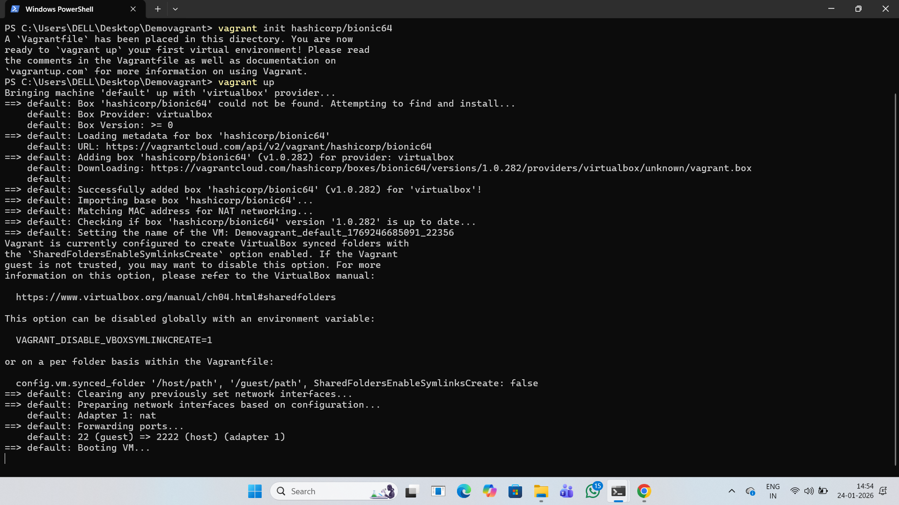
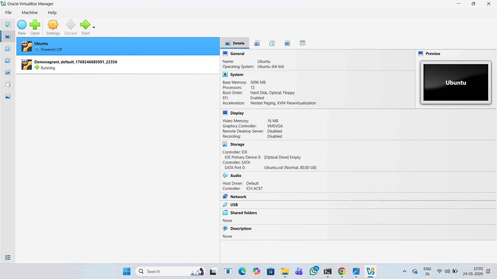

# Experiment 1: Comparison of VMs and Containers

**Student Name:** RAJ VARDHAN SINGH  
**Date:** 24 JAN,2026

**SAP ID:** 500123753 

**Course:** Containerization and DevOps Lab

## 🎯 Objective
To understand the conceptual and practical differences between Virtual Machines and Containers by deploying Nginx in both environments.

## 📋 Part A: Virtual Machine Setup

### Step 1: Vagrant VM Creation


*Command: `vagrant up` creating Ubuntu VM*

### Step 2: Nginx Installation in VM





*Command: `sudo apt install nginx` and verification with `curl localhost`*

### Step 3: VM Resource Usage

*Command: `free -h` showing memory usage in VM*

## 🐳 Part B: Container Setup

### Step 1: Docker Nginx Container

*Command: `docker run -d -p 8080:80 nginx`*

### Step 2: Container Verification

*Command: `curl localhost:8080` verifying Nginx in container*

### Step 3: Container Resource Usage

*Command: `docker stats` showing container resource usage*

## ⚖️ Comparison Results

### Resource Utilization Table
| Parameter | Virtual Machine | Container |
|-----------|----------------|-----------|
| **Boot Time** | ~45 seconds | ~2 seconds |
| **RAM Usage** | 1.2 GB | 120 MB |
| **Disk Space** | 2.5 GB | 142 MB |
| **Isolation** | Full OS-level | Process-level |

### Screenshot Comparison


*Left: VM resources | Right: Container resources*

## 📊 Key Findings
1. Containers start **20x faster** than VMs
2. Containers use **90% less memory** than VMs
3. VMs provide stronger isolation but higher overhead
4. Containers are more efficient for microservices

## 🧪 Commands Used
```bash
# VM Commands
vagrant init ubuntu/jammy64
vagrant up
vagrant ssh
sudo apt install nginx

# Container Commands
docker pull nginx
docker run -d -p 8080:80 nginx
docker stats
