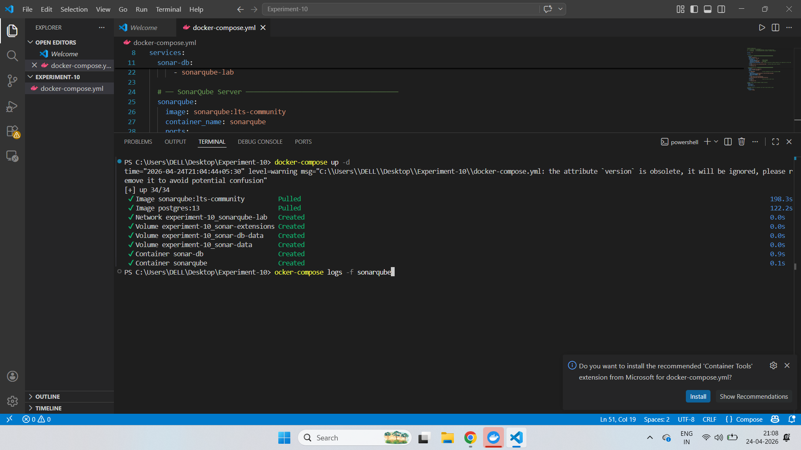

Here's your Lab 10 report reformatted with clear section hierarchy and improved visual structure:

---

# Lab 10 — SonarQube: Continuous Code Quality Inspection

---

## 📌 Objective

To set up SonarQube for continuous code quality inspection, analyze a Java application for bugs, vulnerabilities, and code smells, integrate it into a CI/CD pipeline using Jenkins, and understand how Quality Gates enforce code standards before deployment.

---

## 📖 Theory

### 1.1 What is SonarQube?

SonarQube is an open-source platform for **continuous inspection of code quality**. It performs automatic static analysis to detect:

| Issue Type | Description |
|------------|-------------|
| **Bugs** | Code that will break or behave unexpectedly |
| **Vulnerabilities** | Security-related issues (e.g., SQL injection) |
| **Code Smells** | Maintainability issues that slow development |
| **Duplications** | Repeated code blocks |
| **Coverage** | % of code covered by unit tests |
| **Technical Debt** | Estimated time required to fix all issues |

### 1.2 Architecture

```
[ Your Code ]
      ↓
[ Sonar Scanner ]  →  Analyzes code locally
      ↓
[ SonarQube Server ]  →  Stores results + shows dashboard
      ↓
[ PostgreSQL DB ]  →  Persists all analysis data
```

### 1.3 Key Components

| Component | Role | Analogy |
|-----------|------|---------|
| SonarQube Server | Stores & displays results | Teacher / Examiner |
| Sonar Scanner | Analyzes and sends results | Student writing exam |
| Source Code | What gets analyzed | Answer sheet |

### 1.4 Quality Gate

A **Quality Gate** is a set of conditions that code must satisfy before it can be deployed. If the gate fails, the CI/CD pipeline is blocked — ensuring bad code never reaches production.

---

## 🏗️ Lab Architecture

```
┌─────────────────┐     HTTP      ┌──────────────────┐
│  Developer      │──────────────▶│  SonarQube       │
│  Machine        │               │  Server          │
│  (Maven)        │               │  (Port 9000)     │
└─────────────────┘               └──────────────────┘
        │                                │
        │ source code                    │ JDBC
        ▼                                ▼
┌─────────────────┐               ┌──────────────────┐
│  Calculator.java│               │  PostgreSQL      │
│  (with issues)  │               │  Database        │
└─────────────────┘               └──────────────────┘
```

---

## 📁 Project Structure

```
Lab-10/
├── docker-compose.yml                          # SonarQube + PostgreSQL setup
└── sample-java-app/
    ├── pom.xml                                 # Maven build + Sonar plugin
    ├── Jenkinsfile                             # CI/CD pipeline definition
    ├── sonar-project.properties                # Scanner configuration
    └── src/
        └── main/
            └── java/
                └── com/
                    └── example/
                        └── Calculator.java     # Sample app with intentional issues
```

---

## 🛠️ Setup & Commands

### Step 1 — Start SonarQube Environment

```bash
docker compose up -d
```

**docker-compose.yml:**
```yaml
version: '3.8'

services:
  sonar-db:
    image: postgres:13
    container_name: sonar-db
    environment:
      POSTGRES_USER: sonar
      POSTGRES_PASSWORD: sonar
      POSTGRES_DB: sonarqube
    volumes:
      - sonar-db-data:/var/lib/postgresql/data
    networks:
      - sonarqube-lab

  sonarqube:
    image: sonarqube:lts-community
    container_name: sonarqube
    ports:
      - "9000:9000"
    environment:
      SONAR_JDBC_URL: jdbc:postgresql://sonar-db:5432/sonarqube
      SONAR_JDBC_USERNAME: sonar
      SONAR_JDBC_PASSWORD: sonar
    volumes:
      - sonar-data:/opt/sonarqube/data
      - sonar-extensions:/opt/sonarqube/extensions
    depends_on:
      - sonar-db
    networks:
      - sonarqube-lab

volumes:
  sonar-db-data:
  sonar-data:
  sonar-extensions:

networks:
  sonarqube-lab:
    driver: bridge
```

> **Access SonarQube at:** http://localhost:9000  
> **Default login:** `admin / admin`

---

### Step 2 — Sample Java Application (with Intentional Issues)

**Calculator.java — contains bugs, vulnerabilities, and code smells for analysis:**

```java
package com.example;

public class Calculator {

    // BUG: Division by zero not handled
    public int divide(int a, int b) {
        return a / b;
    }

    // CODE SMELL: Unused variable
    public int add(int a, int b) {
        int result = a + b;
        int unused = 100;   // unused variable
        return result;
    }

    // VULNERABILITY: SQL Injection risk
    public String getUser(String userId) {
        String query = "SELECT * FROM users WHERE id = " + userId;
        return query;
    }

    // CODE SMELL: Duplicate code block
    public int multiply(int a, int b) {
        int result = 0;
        for (int i = 0; i < b; i++) { result = result + a; }
        return result;
    }

    public int multiplyAlt(int a, int b) {
        int result = 0;
        for (int i = 0; i < b; i++) { result = result + a; }
        return result;
    }

    // CODE SMELL: Too many parameters
    public void processUser(String name, String email, String phone,
                            String address, String city, String state,
                            String zip, String country) {
        System.out.println("Processing: " + name);
    }

    // BUG: NullPointerException if name is null
    public String getName(String name) {
        return name.toUpperCase();
    }

    // CODE SMELL: Empty catch block (swallowing exception)
    public void riskyOperation() {
        try {
            int x = 10 / 0;
        } catch (Exception e) {
            // swallowed — bad practice
        }
    }
}
```

---

### Step 3 — Maven Configuration

**pom.xml:**

```xml
<properties>
    <maven.compiler.source>11</maven.compiler.source>
    <maven.compiler.target>11</maven.compiler.target>
    <sonar.projectKey>sample-java-app</sonar.projectKey>
    <sonar.projectName>Sample Java Application</sonar.projectName>
    <sonar.host.url>http://localhost:9000</sonar.host.url>
</properties>

<build>
  <plugins>
    <plugin>
      <groupId>org.sonarsource.scanner.maven</groupId>
      <artifactId>sonar-maven-plugin</artifactId>
      <version>3.9.1.2184</version>
    </plugin>
  </plugins>
</build>
```

---

### Step 4 — Run SonarQube Analysis

```bash
# Compile the project
mvn clean compile

# Run the scan (replace with your generated token)
mvn sonar:sonar -Dsonar.login=YOUR_SONAR_TOKEN
```

> **Generate a token:** SonarQube → My Account → Security → Generate Token

---

### Step 5 — Jenkins CI/CD Integration

**Jenkinsfile:**

```groovy
pipeline {
    agent any

    environment {
        SONAR_HOST_URL = 'http://sonarqube:9000'
        SONAR_TOKEN = credentials('sonar-token')
    }

    stages {
        stage('Checkout') {
            steps { checkout scm }
        }

        stage('SonarQube Analysis') {
            steps {
                withSonarQubeEnv('SonarQube') {
                    sh 'mvn clean verify sonar:sonar'
                }
            }
        }

        stage('Quality Gate') {
            steps {
                timeout(time: 1, unit: 'HOURS') {
                    waitForQualityGate abortPipeline: true
                }
            }
        }

        stage('Build') {
            steps { sh 'mvn package' }
        }

        stage('Deploy') {
            steps {
                sh 'docker build -t sample-app .'
                sh 'docker run -d -p 8080:8080 sample-app'
            }
        }
    }
}
```

---

### Step 6 — API Verification

```bash
# Fetch all bugs
curl -u admin:admin123 \
  "http://localhost:9000/api/issues/search?projectKeys=sample-java-app&types=BUG"

# Fetch vulnerabilities
curl -u admin:admin123 \
  "http://localhost:9000/api/issues/search?projectKeys=sample-java-app&types=VULNERABILITY"

# Full metrics summary (pretty printed)
curl -u admin:admin123 \
  "http://localhost:9000/api/measures/component?component=sample-java-app&metricKeys=bugs,vulnerabilities,code_smells,coverage,duplicated_lines_density,sqale_debt_ratio,reliability_rating,security_rating" \
  | python3 -m json.tool
```

---

## 📊 Analysis Results

### Before Fix

| Metric | Count |
|--------|-------|
| Bugs | 2 |
| Vulnerabilities | 1 |
| Code Smells | 5+ |
| Duplications | 2 blocks |
| Test Coverage | 0% |
| Technical Debt | ~2 hours |

### After Fixing Divide-by-Zero Bug

**Fixed code:**
```java
// Fixed: Division by zero now handled
public int divide(int a, int b) {
    if (b == 0) {
        throw new IllegalArgumentException("Cannot divide by zero");
    }
    return a / b;
}
```

**Re-run scan:**
```bash
mvn clean compile
mvn sonar:sonar -Dsonar.login=YOUR_SONAR_TOKEN
```

| Metric | Before | After Fix |
|--------|--------|-----------|
| Bugs | 2 | 1 ✅ |
| Vulnerabilities | 1 | 1 |
| Code Smells | 5+ | 5+ |

> The dashboard reflects the reduced bug count after re-scan — demonstrating SonarQube's continuous feedback loop.

---

## 🔄 CI/CD Flow with Quality Gate

```
Developer commits code
        ↓
Jenkins triggers pipeline
        ↓
mvn clean verify sonar:sonar
        ↓
SonarQube analyzes code
        ↓
Quality Gate evaluated
    ↙           ↘
PASS              FAIL
  ↓                 ↓
Build continues   Pipeline blocked 
Deploy to server  Fix issues first
```

---

## 📸 Screenshots


---

## 📚 Key Concepts Covered

| Concept | What Was Demonstrated |
|---------|----------------------|
| **Quality Gate** | Default "Sonar way" gate applied to project |
| **Technical Debt** | ~2 hours estimated fix time shown in dashboard |
| **Static Analysis** | Maven plugin scanned code without running it |
| **CI/CD Integration** | Jenkinsfile blocks deployment on gate failure |
| **Multi-issue Detection** | Bugs, vulnerabilities, code smells all detected |
| **Feedback Loop** | Fixed bug → re-scanned → dashboard updated |

---

## 🔍 Tool Comparison

| Feature | Jenkins | Ansible | Chef | SonarQube |
|---------|---------|---------|------|-----------|
| Primary Purpose | CI/CD Automation | Config Management | Config Management | Code Quality |
| Architecture | Master-Agent | Agentless | Client-Server | Client-Server |
| Language | Groovy | YAML | Ruby | Java |
| Learning Curve | Moderate | Low | High | Low |
| Idempotency | No | Yes | Yes | N/A |

---

## 🧹 Cleanup

```bash
docker compose down -v
```

*This removes all containers and volumes.*

---

## 🔗 References

- [SonarQube Official Documentation](https://docs.sonarqube.org/)
- [SonarQube Docker Hub](https://hub.docker.com/_/sonarqube)
- [Maven Sonar Plugin](https://docs.sonarqube.org/latest/analyzing-source-code/scanners/sonarscanner-for-maven/)
- [SonarQube Quality Gates](https://docs.sonarqube.org/latest/user-guide/quality-gates/)

---

**End of Lab Report**
