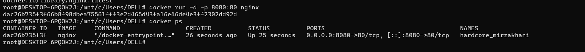

# Experiment 2: Docker Installation, Configuration and Running Images

**Student Name:** RAJ VARDHAN SINGH  
**Date:** 24 JAN, 2026  

**SAP ID:** 500123753  

**Course:** Containerization and DevOps Lab  

---

## 🎯 Objective
To install and configure Docker, pull Docker images from Docker Hub, run Docker containers, verify running services, and understand basic Docker container and image management using Nginx.

---


## 🐳 Part A: Working with Docker Images

---

### Step 1: Pull Nginx Image from Docker Hub
  
*Command: `docker pull nginx` to download Nginx image*

---

### Step 2: Verify Pulled Nginx Image
  
*Command: `docker images nginx` to verify image download*

---

## 🚀 Part B: Running Docker Containers

### Step 3: Run Nginx Docker Container
  
*Command: `docker run -d -p 8080:80 nginx` to start container*

---

### Step 5: Verify Running Docker Container
  
*Command: `docker ps` to view running containers*

---

### Step 4: Verify Nginx Service
  
*Accessing `http://localhost:8080` in browser to verify Nginx*

---

## 🛑 Part D: Container and Image Management

### Step 5: Stop Running Container
  
*Command: `docker stop <container_id>` to stop container*

---

### Step 6: Remove Docker Container
  
*Command: `docker rm <container_id>` to remove container*

---

### Step 7: Remove Docker Image
  
*Command: `docker rmi nginx` to remove Docker image*

---

## 🧪 Commands Used
```bash
wsl
docker --version
docker info
docker images
docker pull nginx
docker run -d -p 8080:80 nginx
docker ps
docker stop <container_id>
docker rm <container_id>
docker rmi nginx

