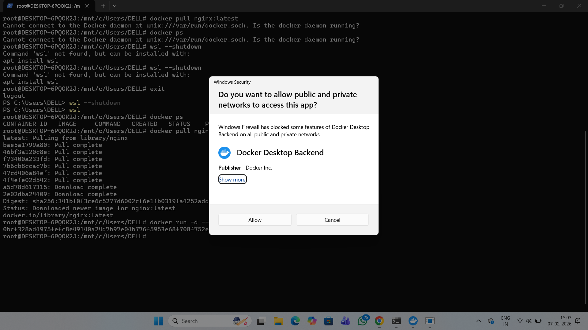
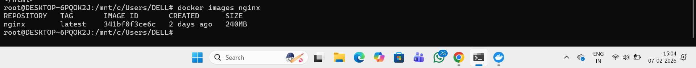
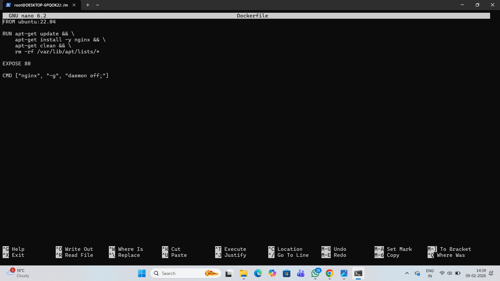
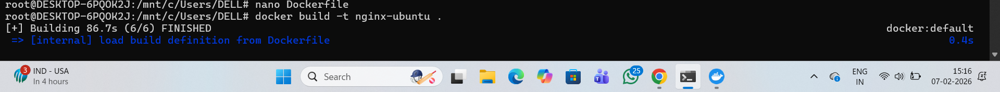

# Experiment 3: NGINX Installation and Configuration Using Docker

**Student Name:** RAJ VARDHAN SINGH  
**Date:** 7 JAN, 2026  

**SAP ID:** 500123753  

**Course:** Containerization and DevOps Lab  

---

## 🎯 Objective
To install and configure the NGINX web server using Docker, build and run NGINX containers, compare official and custom Docker images, and serve static web content using Docker volumes.

---

## 🐳 Part A: Working with Official NGINX Docker Image

### Step 1: Pull NGINX Image from Docker Hub

### Step 2: Run the container

### Step 3: Verify

### Step 4:Verification from docker

## 🐳 Part B: Custom NGINX using Ubuntu Image

### Step 1: Create Dockerfile (Ubuntu)

### Step 2: Build Ubuntu Image

### Step 9: Run Ubuntu-Based NGINX

Step 10: Create Dockerfile (Alpine)

FROM alpine:latest
RUN apk add --no-cache nginx
EXPOSE 80
CMD ["nginx", "-g", "daemon off;"]

Step 11: Build Alpine Image

docker build -t nginx-alpine .

Step 12: Run Alpine-Based NGINX

docker run -d -p 8082:80 nginx-alpine

Step 13: Compare NGINX Images

docker images | grep nginx

Step 14: Check Image History

docker history nginx
docker history nginx-ubuntu
docker history nginx-alpine

Step 15: Create Custom HTML

mkdir html
echo "<h1>Hello from Docker NGINX</h1>" > html/index.html

Step 16: Run NGINX with Volume Mount

docker run -d -p 8083:80 -v $(pwd)/html:/usr/share/nginx/html nginx

### 🧪 Commands Used
docker --version

docker pull nginx

docker images

docker run -d -p 8080:80 nginx

docker build -t nginx-ubuntu .

docker build -t nginx-alpine .

docker images | grep nginx

docker history nginx
