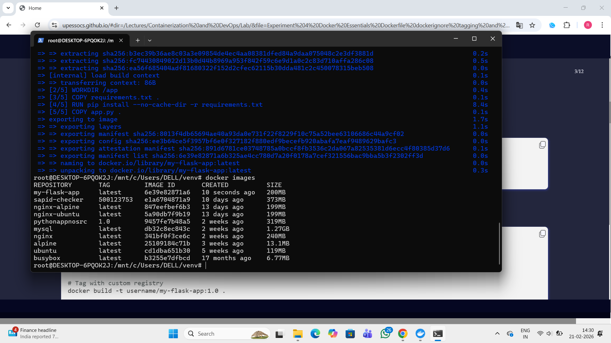
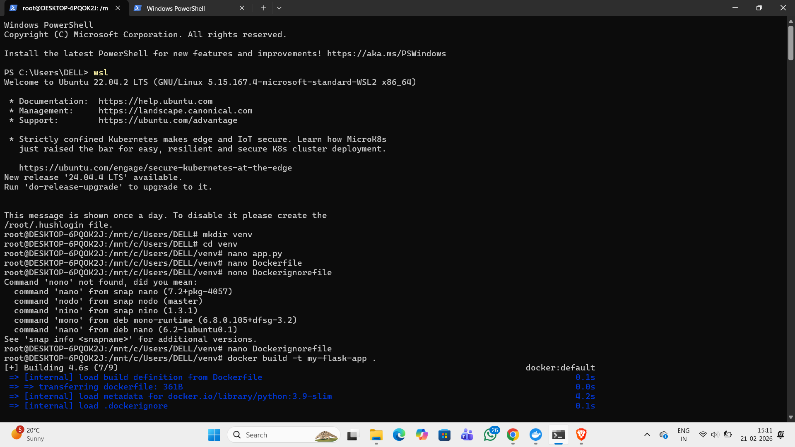
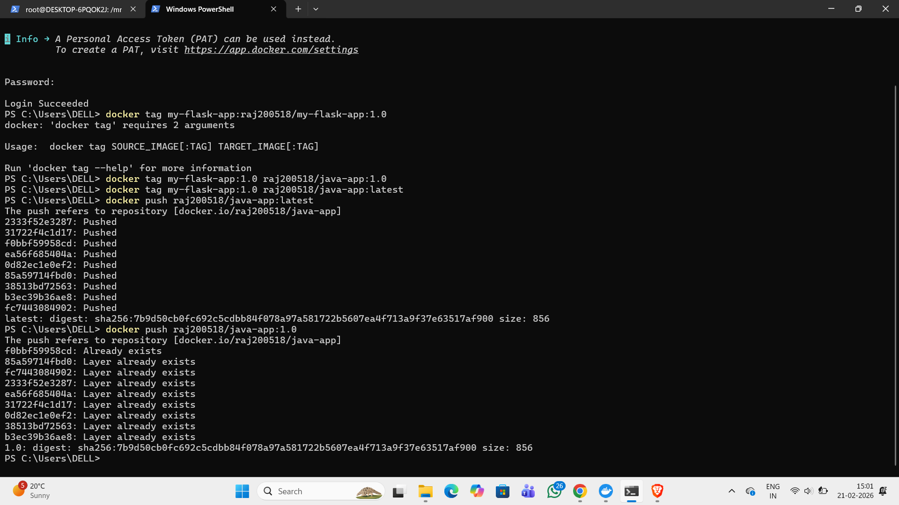
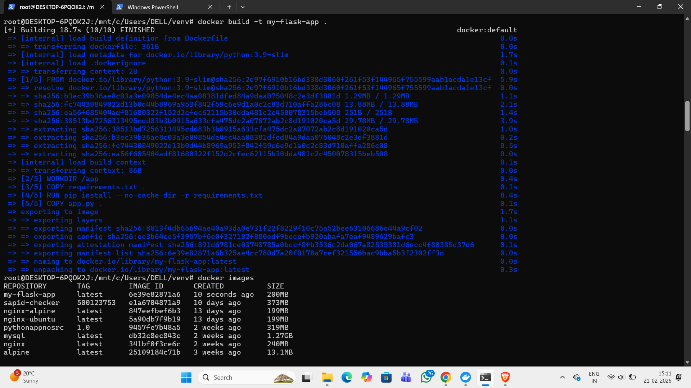
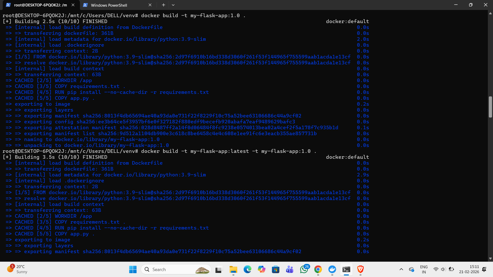
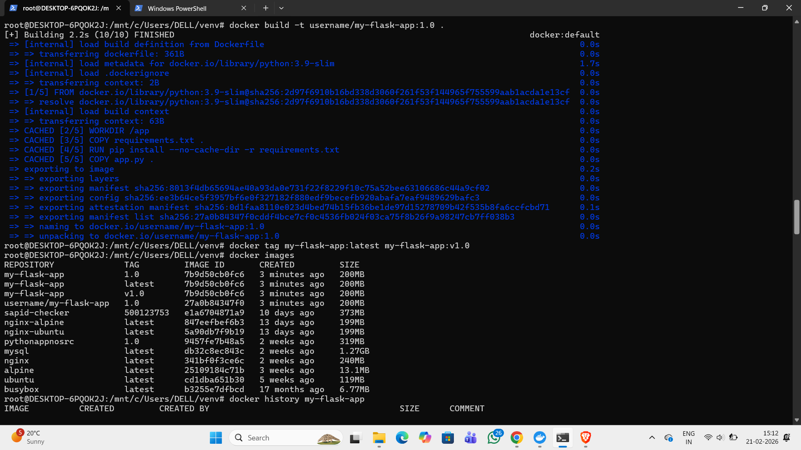
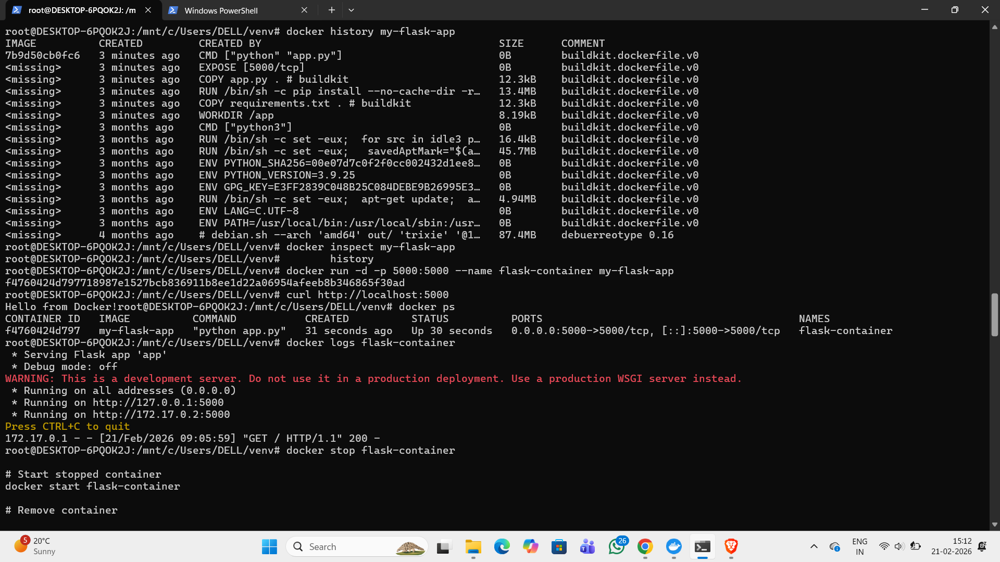
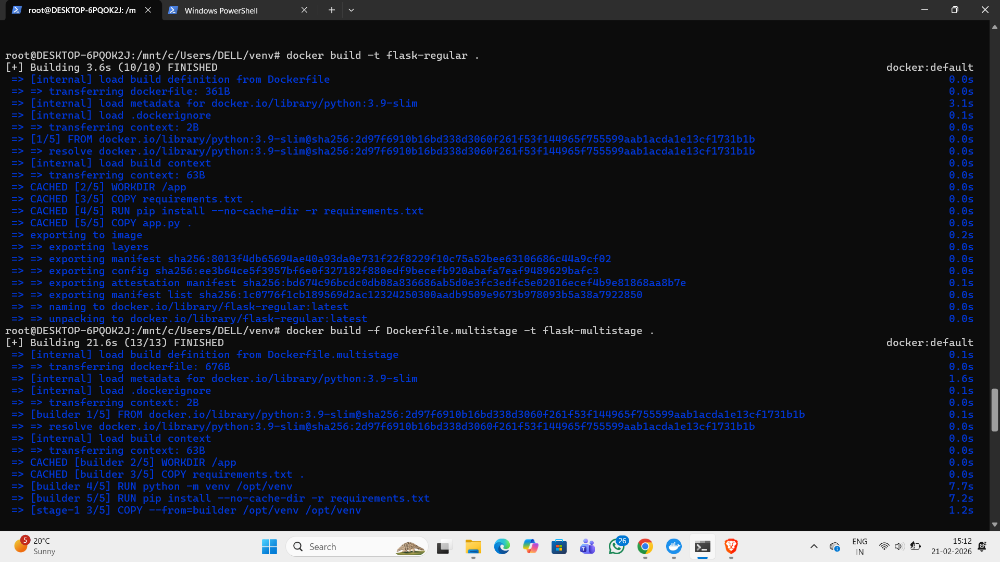
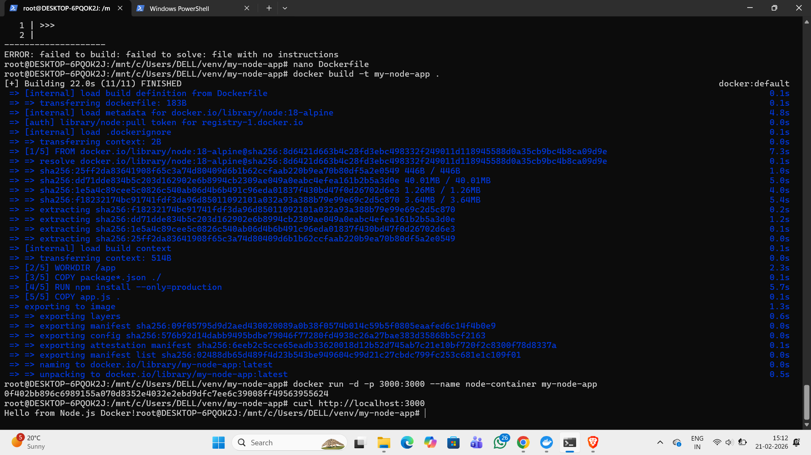

# Name: Raj Vardhan Singh  
# Course: Containerization and DevOps Lab  
#  🧪 Experiment 4  
# Docker Essentials: Dockerfile, .dockerignore, Tagging & Publishing

---

## 🎯 Aim

To understand and implement Dockerfile creation, use of .dockerignore, image tagging, and publishing Docker images to Docker Hub.

---

## 📘 Theory

Docker is a containerization platform that allows applications to run in isolated environments called containers.  
A Docker image is built using a Dockerfile, which contains step-by-step instructions.

Key Components:

- **Dockerfile** – Defines how an image is built.
- **.dockerignore** – Excludes unnecessary files from the build context.
- **Tagging** – Assigns a name and version to Docker images.
- **Publishing** – Uploading images to Docker Hub or a registry.

---

## 🛠️ Requirements

- Docker installed (Docker Desktop / Docker Engine)
- Internet connection
- Docker Hub account

---

## 📂 Project Structure

```
project-folder/
│
├── Dockerfile
├── .dockerignore
├── app.py
└── README.md
```

---

## 🐳 Step 1: Create Dockerfile

Create a file named `Dockerfile`:

```dockerfile
FROM ubuntu:latest

WORKDIR /app

COPY . .

RUN apt-get update && apt-get install -y python3

CMD ["bash"]
```


### Explanation of Instructions

- `FROM` → Specifies base image  
- `WORKDIR` → Sets working directory  
- `COPY` → Copies files into container  
- `RUN` → Executes commands during build  
- `CMD` → Default command when container runs  

---

## 🚫 Step 2: Create .dockerignore

Create a file named `.dockerignore`:

```
.git
node_modules
*.log
__pycache__
Dockerfile
```

### Purpose of .dockerignore

- Reduces build size  
- Improves performance  
- Prevents unnecessary files from entering image  

---



## 🏗️ Step 3: Build Docker Image

Build the image using:

```bash
docker build -t myapp:1.0 .
```

Check available images:

```bash
docker images
```

---

## 🏷️ Step 4: Tag the Image

Tag the image for Docker Hub:

```bash
docker tag myapp:1.0 username/myapp:1.0
```

Example:

```bash
docker tag myapp:1.0 rajvardhan/myapp:1.0
```

---




## 🔐 Step 5: Login to Docker Hub

```bash
docker login
```

Enter your Docker Hub username and password.

---

## 📦 Step 6: Push Image to Docker Hub

```bash
docker push username/myapp:1.0
```




Example:

```bash
docker push rajvardhan/myapp:1.0
```

---

## 📥 Pull Image from Docker Hub

To download the image:

```bash
docker pull username/myapp:1.0


```

---

## ✅ Result

The Docker image was successfully built, tagged, and pushed to Docker Hub.

---

## 📌 Conclusion

This experiment demonstrates the complete Docker workflow:

1. Writing a Dockerfile  
2. Creating a .dockerignore file  
3. Building a Docker image  
4. Tagging the image  
5. Publishing it to Docker Hub  

These are essential skills for DevOps and containerized application deployment.

---


