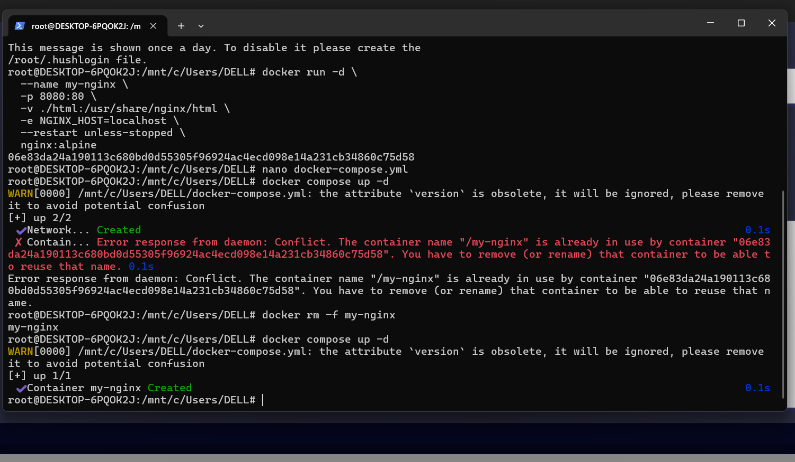
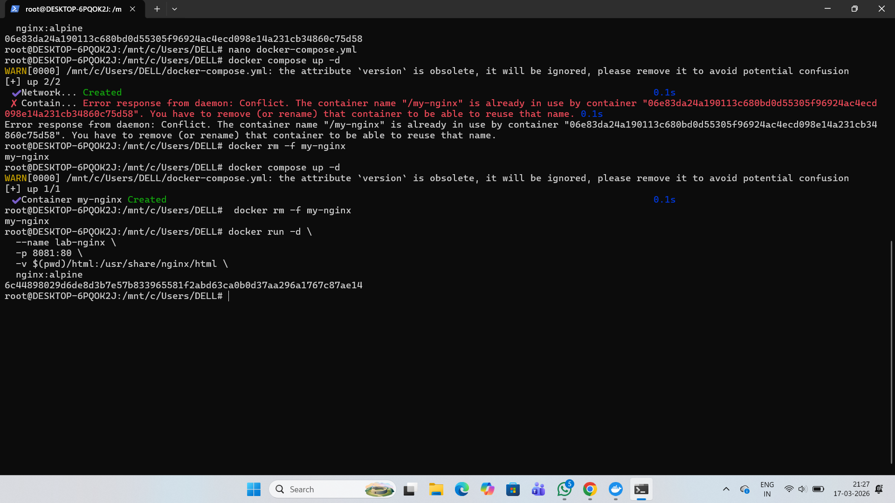
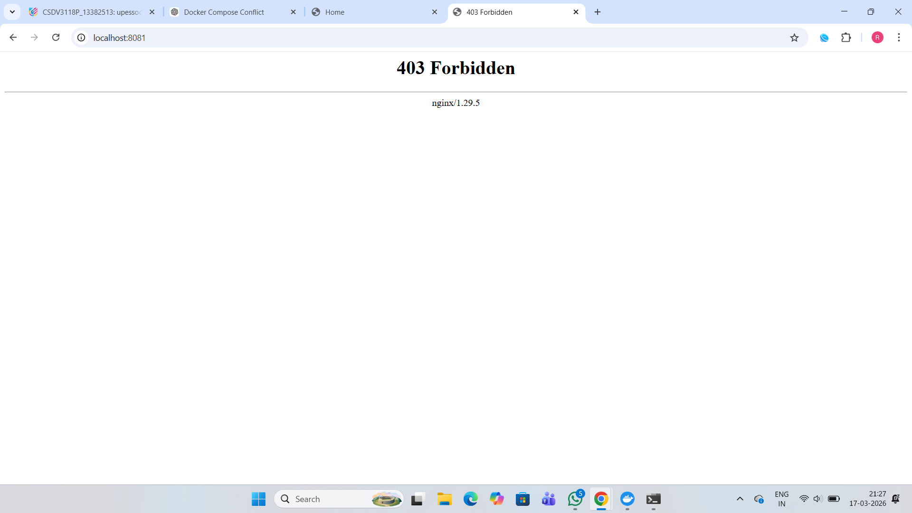

# Experiment 6 – Docker Run vs Docker Compose

This lab demonstrates how to run containers using **docker run** and how the same configuration can be defined using **Docker Compose**. Docker Compose simplifies management of multi‑container applications by storing configuration in a YAML file.

---

# 1. Important `docker run` Options

| Option      | Purpose                      |
| ----------- | ---------------------------- |
| `-p`        | Port mapping                 |
| `-v`        | Volume mount                 |
| `-e`        | Environment variables        |
| `--network` | Connect container to network |
| `--restart` | Restart policy               |
| `--memory`  | Limit RAM usage              |
| `--cpus`    | Limit CPU usage              |
| `--name`    | Container name               |
| `-d`        | Run container in background  |

---

# 2. Example: Running Nginx using docker run

```bash
docker run -d \
  --name my-nginx \
  -p 8080:80 \
  -v ./html:/usr/share/nginx/html \
  -e NGINX_HOST=localhost \
  --restart unless-stopped \
  nginx:alpine
```

## Explanation

| Part                              | Meaning                            |
| --------------------------------- | ---------------------------------- |
| `-d`                              | Run container in background        |
| `--name my-nginx`                 | Container name                     |
| `-p 8080:80`                      | Host port 8080 → Container port 80 |
| `-v ./html:/usr/share/nginx/html` | Mount local html folder            |
| `-e`                              | Set environment variable           |
| `--restart unless-stopped`        | Restart automatically              |
| `nginx:alpine`                    | Docker image                       |

### Screenshot – Running Container



---

# 3. Same Configuration Using Docker Compose

## `docker-compose.yml`

```yaml
version: '3.8'

services:
  nginx:
    image: nginx:alpine
    container_name: my-nginx
    ports:
      - "8080:80"
    volumes:
      - ./html:/usr/share/nginx/html
    environment:
      NGINX_HOST: localhost
    restart: unless-stopped
```

Run the container

```bash
docker compose up -d
```

### Screenshot – Docker Compose Running


---

# 4. Docker Run vs Docker Compose Mapping

| Docker Run          | Docker Compose                   |
| ------------------- | -------------------------------- |
| `-p 8080:80`        | `ports:`                         |
| `-v host:container` | `volumes:`                       |
| `-e KEY=value`      | `environment:`                   |
| `--name`            | `container_name:`                |
| `--network`         | `networks:`                      |
| `--restart`         | `restart:`                       |
| `--memory`          | `deploy.resources.limits.memory` |
| `--cpus`            | `deploy.resources.limits.cpus`   |

---

# 5. Lab Example 1 – Nginx Web Server

## Using docker run

```bash
docker run -d \
  --name lab-nginx \
  -p 8081:80 \
  -v $(pwd)/html:/usr/share/nginx/html \
  nginx:alpine
```

Check running containers

```bash
docker ps
```

Open browser

```
http://localhost:8081
```

Stop and remove

```bash
docker stop lab-nginx

docker rm lab-nginx
```

### Screenshot – Browser Output




---

## Using Docker Compose

```yaml
version: '3.8'

services:
  nginx:
    image: nginx:alpine
    container_name: lab-nginx
    ports:
      - "8081:80"
    volumes:
      - ./html:/usr/share/nginx/html
```

Run

```bash
docker compose up -d
```

Check containers

```bash
docker compose ps
```

Stop

```bash
docker compose down
```

### Screenshot – Compose Containers


---

# 6. Lab Example 2 – WordPress with MySQL

## Using docker run

Create network

```bash
docker network create wp-net
```

Run MySQL

```bash
docker run -d \
  --name mysql \
  --network wp-net \
  -e MYSQL_ROOT_PASSWORD=secret \
  -e MYSQL_DATABASE=wordpress \
  mysql:5.7
```

Run WordPress

```bash
docker run -d \
  --name wordpress \
  --network wp-net \
  -p 8082:80 \
  -e WORDPRESS_DB_HOST=mysql \
  -e WORDPRESS_DB_PASSWORD=secret \
  wordpress:latest
```

Open in browser

```
http://localhost:8082
```

### Screenshot – WordPress Setup Page


---

## Using Docker Compose

```yaml
version: '3.8'

services:

  mysql:
    image: mysql:5.7
    environment:
      MYSQL_ROOT_PASSWORD: secret
      MYSQL_DATABASE: wordpress
    volumes:
      - mysql_data:/var/lib/mysql

  wordpress:
    image: wordpress:latest
    ports:
      - "8082:80"
    environment:
      WORDPRESS_DB_HOST: mysql
      WORDPRESS_DB_PASSWORD: secret
    depends_on:
      - mysql

volumes:
  mysql_data:
```

Run

```bash
docker compose up -d
```

Stop and remove volumes

```bash
docker compose down -v
```

### Screenshot – Compose WordPress Containers


---

# 7. Resource Limiting Example

## Docker Run

```bash
docker run -d \
  --name limited-app \
  -p 9000:9000 \
  --memory="256m" \
  --cpus="0.5" \
  --restart always \
  nginx:alpine
```

## Docker Compose

```yaml
deploy:
  resources:
    limits:
      memory: 256M
      cpus: "0.5"
```

---

# 8. Docker Compose Build Example (Node App)

## `app.js`

```javascript
const http = require('http');

http.createServer((req, res) => {
  res.end("Docker Compose Build Lab");
}).listen(3000);
```

---

## `Dockerfile`

```dockerfile
FROM node:18-alpine

WORKDIR /app

COPY app.js .

EXPOSE 3000

CMD ["node", "app.js"]
```

---

## `docker-compose.yml`

```yaml
version: '3.8'

services:

  nodeapp:
    build:
      context: .
      dockerfile: Dockerfile
    container_name: custom-node-app
    ports:
      - "3000:3000"
```

Build and run

```bash
docker compose up --build -d
```

Open browser

```
http://localhost:3000
```

Check images

```bash
docker images
```

### Screenshot – Node App Output


---

# 9. Scaling Containers

```bash
docker compose up --scale web=3
```

This command starts **3 instances of the same service**.

### Screenshot – Scaled Containers


---

# 10. Conclusion

**Docker Run**

* Used to start **single containers manually**
* Configuration given via **command line flags**

**Docker Compose**

* Used to run **multiple containers together**
* Configuration written in **docker-compose.yml**

Docker Compose simplifies development, testing, and deployment of **multi‑container applications**.
