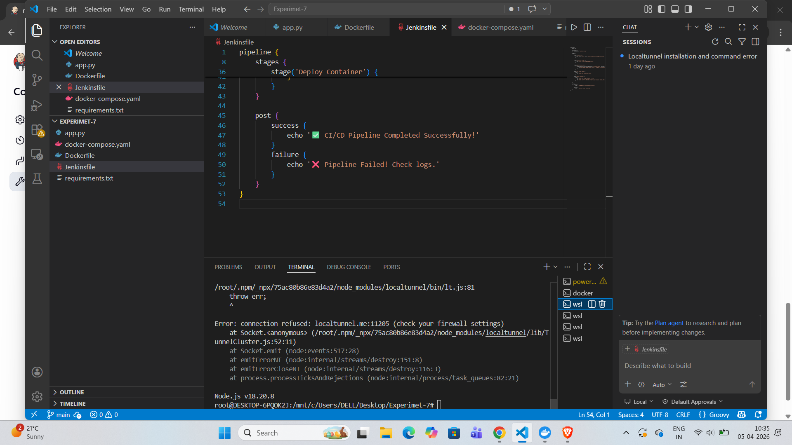
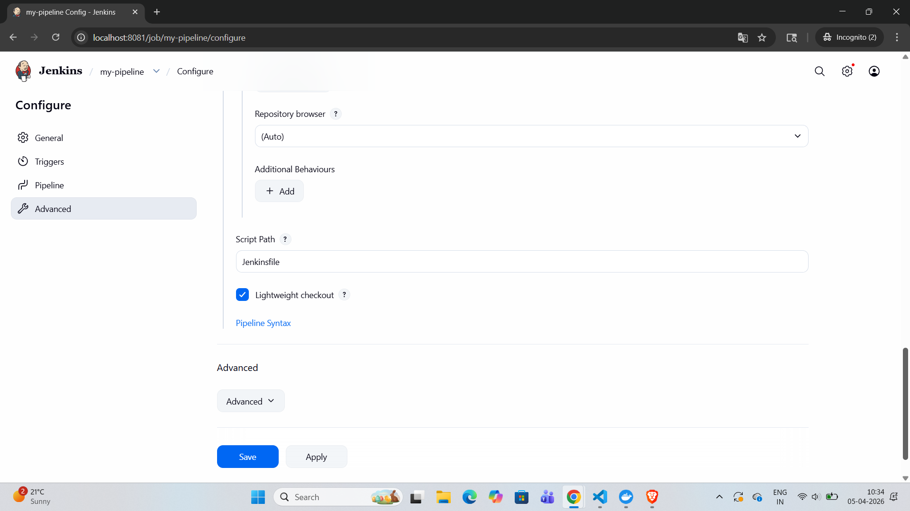
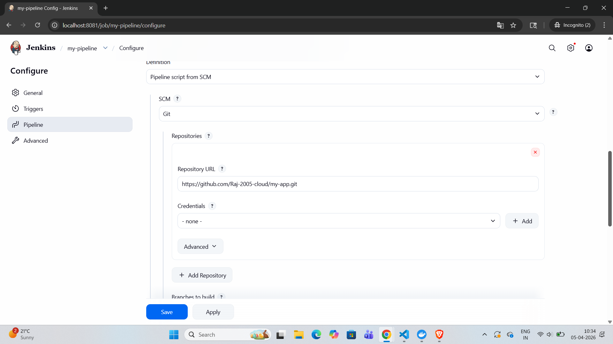
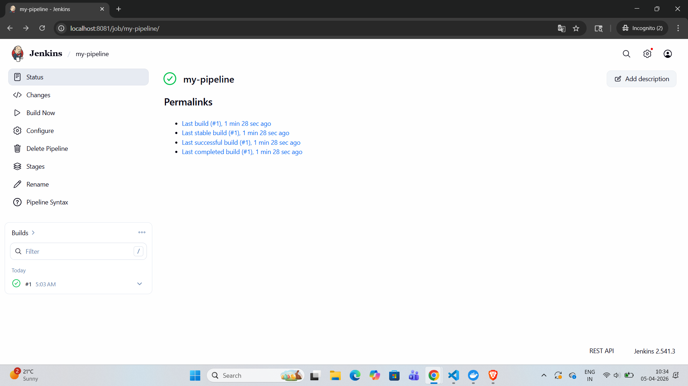
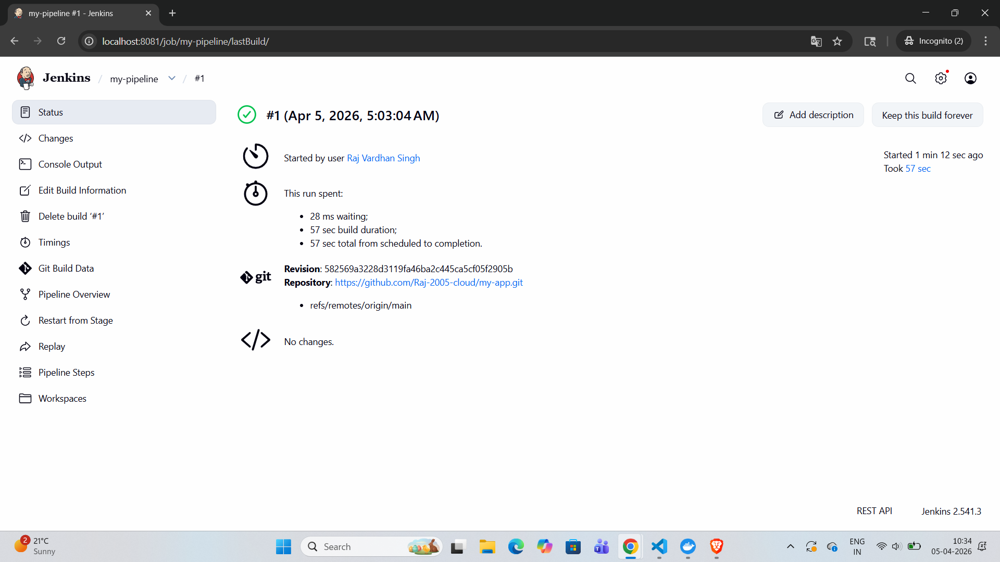

# Lab Experiment 7: CI/CD Pipeline using Jenkins, GitHub and Docker Hub


## Aim
To design and implement a complete CI/CD pipeline using **Jenkins**, integrating source code from **GitHub**, and building & pushing Docker images to **Docker Hub** automatically on every code push.

---

## Workflow
```
Developer → git push → GitHub → Webhook → Jenkins → Docker Build → Docker Hub
```

---

## Project Structure
```
my-app/
├── app.py              # Flask web application
├── requirements.txt    # Python dependencies
├── Dockerfile          # Docker image build instructions
└── Jenkinsfile         # Jenkins pipeline definition
```

---

## Application Code

### `app.py`
```python
from flask import Flask
app = Flask(__name__)

@app.route("/")
def home():
    return "Hello from CI/CD Pipeline!"

app.run(host="0.0.0.0", port=80)
```

### `requirements.txt`
```txt
flask
```

### `Dockerfile`
```dockerfile
FROM python:3.10-slim

WORKDIR /app
COPY . .

RUN pip install -r requirements.txt

EXPOSE 80
CMD ["python", "app.py"]
```

### `Jenkinsfile`
```groovy
pipeline {
    agent any

    environment {
        IMAGE_NAME = "your-dockerhub-username/myapp"
    }

    stages {

        stage('Clone Source') {
            steps {
                git branch: 'main', url: 'https://github.com/your-username/my-app.git'
            }
        }

        stage('Build Docker Image') {
            steps {
                sh 'docker build -t $IMAGE_NAME:latest .'
            }
        }

        stage('Login to Docker Hub') {
            steps {
                withCredentials([string(credentialsId: 'dockerhub-token', variable: 'DOCKER_TOKEN')]) {
                    sh 'echo $DOCKER_TOKEN | docker login -u your-dockerhub-username --password-stdin'
                }
            }
        }

        stage('Push to Docker Hub') {
            steps {
                sh 'docker push $IMAGE_NAME:latest'
            }
        }
    }
}
```

---

## Setup Instructions

### Prerequisites
- Docker Desktop installed (Apple Silicon / ARM64 for Mac M1)
- GitHub account
- Docker Hub account
- ngrok account (for webhook)

---

### Step 1: Jenkins Setup using Docker

**Dockerfile for Jenkins (ARM64):**
```dockerfile
FROM jenkins/jenkins:lts

USER root

RUN apt-get update -y && \
    apt-get install -y curl ca-certificates gnupg && \
    install -m 0755 -d /etc/apt/keyrings && \
    curl -fsSL https://download.docker.com/linux/debian/gpg | gpg --dearmor -o /etc/apt/keyrings/docker.gpg && \
    chmod a+r /etc/apt/keyrings/docker.gpg && \
    echo "deb [arch=arm64 signed-by=/etc/apt/keyrings/docker.gpg] https://download.docker.com/linux/debian bookworm stable" > /etc/apt/sources.list.d/docker.list && \
    apt-get update -y && \
    apt-get install -y docker-ce-cli && \
    groupadd -f docker && \
    usermod -aG docker jenkins

USER jenkins
```

**Build and Run Jenkins:**
```bash
# Build ARM64 Jenkins image
docker build --platform linux/arm64 -t jenkins-arm64 .

# Run Jenkins container
docker run -d \
  --name jenkins \
  --platform linux/arm64 \
  -p 8080:8080 \
  -p 50000:50000 \
  -v jenkins_home:/var/jenkins_home \
  -v /var/run/docker.sock:/var/run/docker.sock \
  -u root \
  jenkins-arm64

# Fix Docker socket permissions
docker exec -it --user root jenkins chmod 666 /var/run/docker.sock

# Create symlink
docker exec -it --user root jenkins ln -sf /usr/bin/docker /usr/local/bin/docker
```

**Get Jenkins unlock password:**
```bash
docker exec -it jenkins cat /var/jenkins_home/secrets/initialAdminPassword
```

---

### Step 2: Jenkins Configuration

**Add Docker Hub Credentials:**
```bash
Manage Jenkins → Credentials → (global) → Add Credentials
  Kind: Secret text
  ID: dockerhub-token
  Secret: <your Docker Hub access token>
```

---

### Step 3: GitHub Webhook Setup

**Install ngrok:**
```bash
brew install ngrok
ngrok config add-authtoken YOUR_NGROK_TOKEN
ngrok http 8080
```

---

## Pipeline Stages

| Stage              | Description                                      | Status |
|--------------------|--------------------------------------------------|--------|
| Checkout SCM       | Jenkins fetches Jenkinsfile from GitHub          | Done   |
| Clone Source       | Pulls latest application code                    | Done   |
| Build Docker Image | Builds image using Dockerfile                    | Done   |
| Login to Docker Hub| Authenticates using stored token                 | Done   |
| Push to Docker Hub | Pushes image to Docker Hub registry              | Done   |

---

## Key Concepts

### Why Docker in CI/CD?
Docker ensures **consistent builds** across any environment.

### Why store credentials in Jenkins?
**Security** — Secrets are encrypted and injected only at runtime.

### Role of Docker Socket Mount
Allows Jenkins container to use the host’s Docker daemon directly.

---
### Screenshot – Compose Containers







---
## Result
Successfully implemented a complete **automated CI/CD pipeline** using Jenkins, GitHub, and Docker Hub.

---

## Observations
- Jenkins GUI simplifies pipeline management  
- GitHub + Webhook = true automation  
- Docker ensures reproducible builds  
- Custom ARM64 Jenkins image is required for Mac M1  

---
