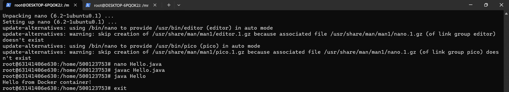
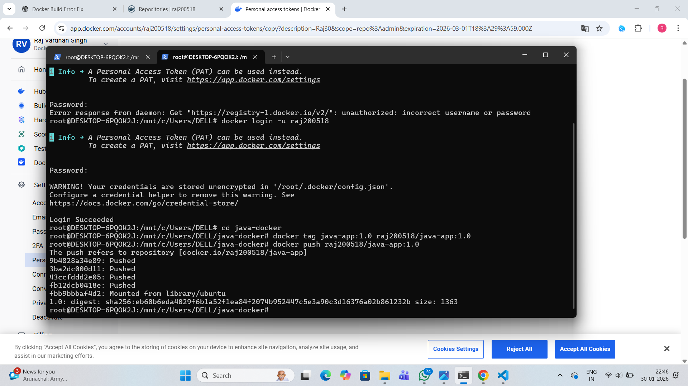

# 🐳 Dockerizing a Java Application Using Ubuntu 22.04

## 🎯 Aim
To containerize a Java application using Docker, build an image from a Dockerfile based on Ubuntu 22.04 with OpenJDK 17, and publish the image to Docker Hub for sharing and deployment.

---

## 🛠️ Tools & Technologies Used
- Docker  
- Ubuntu 22.04  
- OpenJDK 17  
- Java  
- Docker Hub  

---

## 📘 Overview
This experiment demonstrates how to containerize a simple Java application using Docker. The process includes creating a Dockerfile, installing dependencies, compiling the Java source file inside the container, building the Docker image, running the container, and finally publishing the image to Docker Hub. Containerization ensures portability, consistency, and simplified deployment across multiple environments.

---

## 📄 Dockerfile
```dockerfile
FROM ubuntu:22.04
RUN apt update && apt install -y openjdk-17-jdk
WORKDIR /home/app
COPY Hello.java .
RUN javac Hello.java
CMD ["java", "Hello"]
```

---

## ⚙️ Implementation Steps

### 1️⃣ Build the Docker Image
```bash
docker build -t java-hello-app .
```

### 2️⃣ Run the Docker Container
```bash
docker run java-hello-app
```

### 3️⃣ Tag the Docker Image
```bash
docker tag java-hello-app <your-dockerhub-username>/java-hello-app
```

### 4️⃣ Push Image to Docker Hub
```bash
docker push <your-dockerhub-username>/java-hello-app
```

---

## 📸 Workflow Screenshots

### 🔹 Docker Image Build Process  


### 🔹 Java Application Running in Container  
  

### 🔹 Docker Image Published on Docker Hub  


---

## ✅ Outcome
- Created a Dockerfile for a Java application  
- Built the Docker image successfully  
- Executed the Java application inside a container  
- Published the Docker image to Docker Hub  

---

## 🏁 Conclusion
Docker simplifies application deployment by packaging the application and its dependencies into a container. Publishing the image to Docker Hub enables portability, reuse, and collaborative development across systems.
